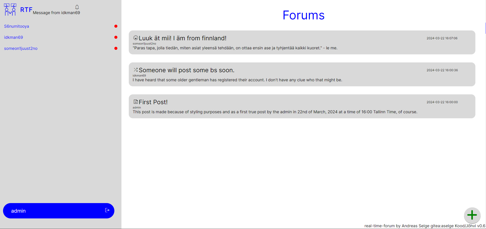
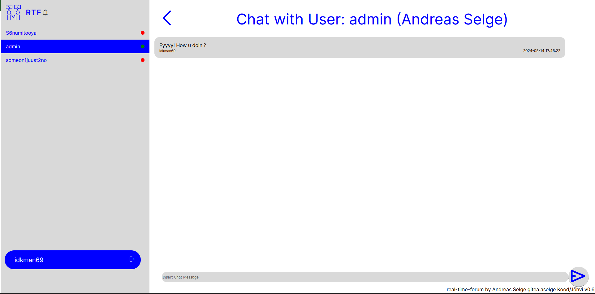

# newforumparaincog



Version 0.6

## Table of Contents
- [Getting Started](#getting-started)
  - [Prerequisites](#prerequisites)
  - [Dependencies](#dependencies)
  - [Installation](#installation)
- [Features](#features)
- [Author](#author)

## Getting Started

### Prerequisites
Make sure you have latest web browser and Node.js installed. Ensure you have Git installed on your machine. Also have your Audit Page ready.

### Dependencies
* Node.js - Server-side JavaScript runtime.
* Express.js - Web application framework for Node.js.
* Websocket - Protocol enabling communication channels over a single connection.

### Installation

#### Required in terminal

1. Clone the repository:
   ```bash
   git clone https://01.kood.tech/git/aselge/real-time-forum.git
   cd real-time-forum
2. Install/Update dependencies:
    ```bash
    npm install
    npm update

3. Start the local server:
    ```bash
    node server.js
4. Open your browser and navigate to http://localhost:4000.

## Features
* Forums
* Chat

## Author

### Andreas Selge

<p>aselge</p>
* <b>Gitea:</b> https://01.kood.tech/git/aselge